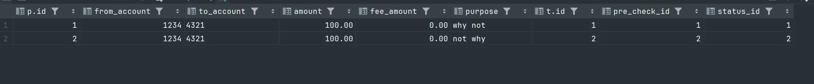

# practice3_report
1) Концепция веток в git:

* Ветки позволяют разработчику работать независимо друг от друга
* Вносить изменения которые не будут влиять на основную кодовую базу, пока мы не сделаем merge
```
git checkout -b dev
git checkout master
git merge dev
```

2) Postgres:  

``` bash

# Запускаем контейнер с postgres:

docker run --name pgTest -e POSTGRES_PASSWORD=1234 -e POSTGRES_USER=postgres -p 5434:5432 -d postgres:16.2

docker exec -it <container hash> bash

# Подключаемся к postgres
psql -U postgres
```
``` SQL 
-- Создаем пользователя
CREATE USER new_user WITH PASSWORD 'secure_password';

-- Даем права на создание базы данных
ALTER USER new_user CREATEDB;

-- Даем права на подключение к существующей базе данных
GRANT CONNECT ON DATABASE postgres TO new_user;


CREATE TABLE public.pre_check(
     id BIGINT PRIMARY KEY,
     from_account INT,
     to_account TEXT,
     amount NUMERIC(10, 2),
     fee_amount NUMERIC(10, 2),
     purpose TEXT
);

CREATE TABLE public.transaction
(
    id           BIGINT PRIMARY KEY,
    pre_check_id BIGINT,
    status_id    INT
);

insert into public.pre_check(id, from_account, to_account, amount, fee_amount, purpose) values(1, 1234, '4321', 100.00, 0.00, 'why not');
insert into public.pre_check(id, from_account, to_account, amount, fee_amount, purpose) values(2, 1234, '4321', 100.00, 0.00, 'not why');

insert into public.transaction(id, pre_check_id, status_id) values(1, 1, 1);
insert into public.transaction(id, pre_check_id, status_id) values(2, 2, 2);

select * from public.pre_check p
join public.transaction t on p.id = t.pre_check_id;
```
Содержимое таблиц:  
